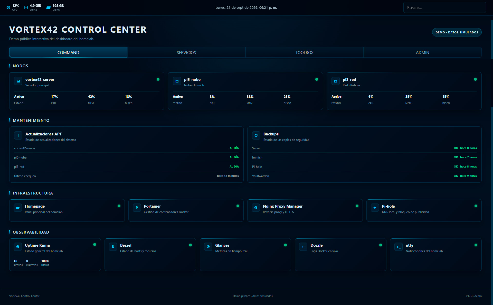

# Vortex42 Control Center Demo

Demo pública e interactiva del dashboard de mi homelab **Vortex42**.

Esta versión fue creada específicamente para mostrar el proyecto sin exponer infraestructura privada, credenciales, direcciones IP internas ni servicios reales.

## Demo

🔗 [Abrir Vortex42 Control Center Demo](https://nicolasrasse.github.io/vortex42-control-center-demo/)

> Todos los estados, métricas, porcentajes y tiempos mostrados son datos simulados.

## Vista previa

## Secciones

### COMMAND

Vista general del estado del homelab:

- Nodos
- Uso de CPU, memoria y almacenamiento
- Actualizaciones APT
- Estado de backups
- Infraestructura
- Observabilidad

### SERVICIOS

Representación de algunos servicios utilizados en el homelab:

- Immich
- Vaultwarden
- Actual Budget
- Gitea
- File Browser

### TOOLBOX

Acceso visual a herramientas técnicas relacionadas con:

- Redes y DNS
- SSL/TLS
- APIs
- Desarrollo
- Seguridad
- Diagnóstico de red

### ADMIN

Representación de accesos administrativos y documentación.

En esta demo ninguna tarjeta administrativa conecta con servicios reales.

## Tecnologías

La demo está construida únicamente con:

- HTML5
- CSS3
- JavaScript

No utiliza frameworks ni backend.

## Interactividad

Incluye:

- Navegación por pestañas
- Buscador de servicios
- Fecha y hora local
- Métricas simuladas
- Diseño responsive
- Atajos de teclado
- Avisos de modo demo

## Seguridad

Esta versión pública:

- No contiene credenciales
- No utiliza tokens
- No contiene variables de entorno
- No expone APIs privadas
- No realiza peticiones al homelab
- No contiene direcciones IP internas
- No permite administrar ningún servicio real

Todo el comportamiento ocurre localmente en el navegador.

## Proyecto original

El dashboard forma parte de **Vortex42**, un homelab personal orientado a:

- Docker
- Linux
- Networking
- Monitorización
- Automatización
- Backups
- Servicios self-hosted
- Seguridad
- Documentación técnica

## Autor

NicolasRasse

GitHub: https://github.com/NicolasRasse
